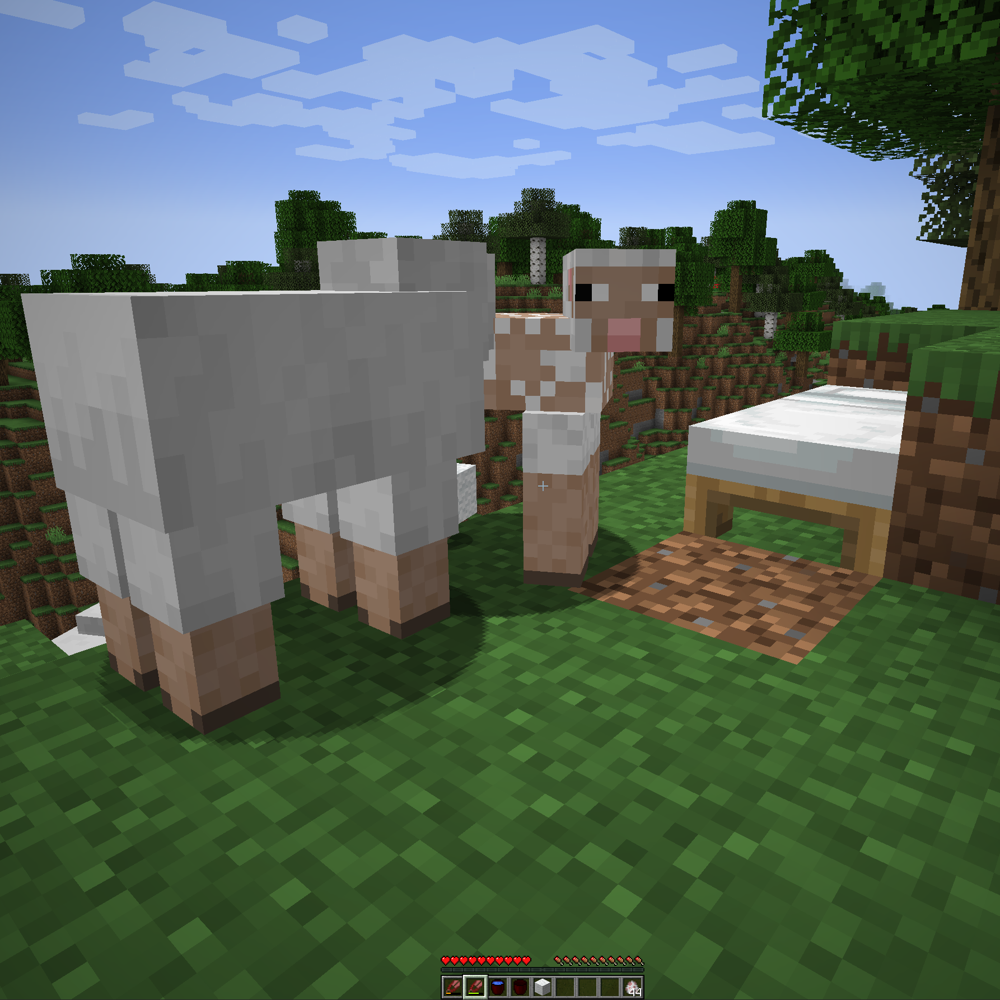

# Minecraft Forge Early to Bed Mod

"Early to bed, early to rise, makes a man healthy, wealthy, and wise"

But when starting a new game in Minecraft you cannot go early to bed.
First you must kill three sheep with your bare hands or with a wooden sword.
Then you create a bed from the spoil of this brutal act and expect to sleep soundly. - Barbaric.

So I made this mod to allow a less violent start.
I have created the wooden shears.
It has pitifully low durability, barely enough to collect 3 wools for your first bed.

There is one more item to help you at the very beginning of a new game: the wooden bucket.
It is similar to a normal bucket, but made of wood, can hold only water, and does not interact with cauldrons.

## License

Standard MIT license. Feel free to learn from it and incorporate it in your own projects.

## Source code

Fabric version: on [GitLab](https://gitlab.com/pintergabor/earlytobed.git) or on [GitHub](https://github.com/pinter-gabor-at/earlytobed.git).  
Forge version: on [GitLab](https://gitlab.com/pintergabor/earlytobed-forge.git) or on [GitHub](https://github.com/pinter-gabor-at/earlytobed-forge.git).

## For developers

Quite often, when I start learning programming on a new platform, I find even the simplest examples too complicated.
Tutorials, written by experts, with years of experience programming on that platform, sometimes forget how difficult those first step are.
This is why I decided to make my first, very simple, Minecraft mods publicly available.

## See also

My other mods on [Modrinth](https://modrinth.com/user/pinter.gabor) and on [CurseForge](https://www.curseforge.com/members/pintergabor/projects).
